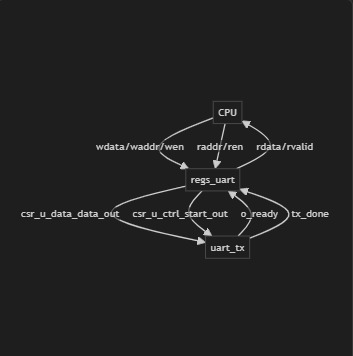
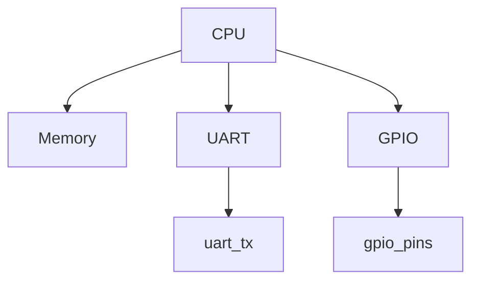

# picoSoC_v3 UART/GPIO Project

## Overview

This project implements a simple System-on-Chip (SoC) in Verilog with:
- A RISC-V compatible CPU (`femtorv32_quark.v`)
- UART transmitter (`uart_tx.v`)
- Memory-mapped register interface (`regs_uart.v`)
- GPIO output (`gpio_ip.v`)
- Firmware written in C, compiled to `firmware.hex`

## What are GPIO and UART?

### GPIO (General Purpose Input/Output)
- **GPIO** stands for General Purpose Input/Output. These are digital pins on a microcontroller, FPGA, or SoC that can be individually programmed as either input or output.
- **Input:** Used to read the state of external devices (e.g., buttons, sensors).
- **Output:** Used to control external devices (e.g., LEDs, relays).
- **Key features:** Simple digital logic (HIGH/LOW), flexible direction, and used for basic interfacing and control tasks in embedded systems.

### UART (Universal Asynchronous Receiver/Transmitter)
- **UART** is a hardware communication protocol for asynchronous serial communication between devices.
- **Usage:** Transmits data one bit at a time over a single wire (TX for transmit, RX for receive). Commonly used for communication between microcontrollers, computers, and peripherals.
- **Key features:** Asynchronous (no separate clock line), data sent in frames (start bit, data bits, stop bit), simple and widely supported in hardware.

| Feature | GPIO | UART |
|---------|------|------|
| Purpose | General digital I/O | Serial communication |
| Direction | Input or Output | Transmit (TX) and Receive (RX) |
| Data | Single bits | Serial data frames |
| Use Cases | LEDs, buttons, sensors | Serial ports, debugging, device comms |

## Directory Structure

```
picoSoC_v3/
  ├── firmware/
  │   ├── main.c
  │   ├── firmware.hex
  │   └── ...
  ├── src/
  │   ├── uart_tx.v
  │   ├── regs_uart.v
  │   ├── Memory.v
  │   ├── femtorv32_quark.v
  │   └── ...
  ├── tb_processor.v
  └── wave.vcd
```

## How to Simulate

1. **Compile the Verilog design:**
   ```sh
   iverilog -o tb_processor.out src/device_select.v src/femtorv32_quark.v src/gpio_ip.v src/Memory.v src/regs_uart.v src/top.v src/uart_ip.v src/uart_tx.v tb_processor.v
   ```

2. **Run the simulation:**
   ```sh
   vvp tb_processor.out
   ```

3. **View the waveform:**
   ```sh
   gtkwave wave.vcd
   ```

## Firmware

- The firmware (`firmware/main.c`) sends a string over UART and toggles GPIO pins.
- Compile the C code with the appropriate toolchain for your CPU and convert to `firmware.hex` for simulation.

## Expected Outputs

### UART Output

- The `uart_tx` signal should show serial transmission of the string "Free Palestine!".
- Example waveform :

  
- UART Working Module Wise:
  
  


### GPIO Output

- The GPIO output toggles between `0x55` and `0xAA` in an infinite loop.
- Example waveform:

## Block Diagram



## Analysis

See [ANALYSIS.md](ANALYSIS.md) for a detailed explanation of each module and the simulation flow.
## Header Files: What I Learned

Header files (with the `.h` extension) are a fundamental part of C programming, especially in embedded systems and hardware-software co-design projects like this one. Here’s a detailed summary of what I learned about using header files in this project:

- **Purpose of Header Files:**
  - Header files allow you to declare functions, macros, constants, and data structures that can be shared across multiple C source files.
  - They help organize code, promote reusability, and make large projects more manageable.

- **Separation of Interface and Implementation:**
  - By placing declarations in header files and implementations in `.c` files, you can separate the interface (what a module does) from its implementation (how it does it).
  - This makes it easier to update or replace modules without affecting other parts of the code.

- **Hardware Register Mapping:**
  - In embedded projects, header files are often used to define memory-mapped register addresses and bitfields for peripherals like UART and GPIO.
  - For example, `gpio_regs.h` and `uart_regs.h` in this project define structures and macros that let the C code access hardware registers using symbolic names instead of hardcoded addresses.

- **Code Readability and Maintainability:**
  - Using header files makes the code more readable and maintainable. Instead of magic numbers, you use meaningful names like `UCSR->U_DATA` or `GCSR->GPIO_0`.
  - If the hardware design changes (e.g., register addresses are updated), you only need to update the header file, not every source file.

- **Avoiding Redefinition and Multiple Inclusion:**
  - Header files should use include guards (`#ifndef`, `#define`, `#endif`) to prevent multiple inclusion, which can cause compilation errors.

- **Sharing Definitions Across Firmware and Hardware:**
  - Sometimes, the same header file (or its contents) can be used to generate both C and Verilog definitions, ensuring consistency between software and hardware.

- **Learning Points in This Project:**
  - I learned how to create and use custom header files for UART and GPIO by using register definitions and Corsair.
  - I understood the importance of using structures and macros to map hardware registers in a portable and readable way.
  - I saw how header files help in scaling up projects, making it easier to add new peripherals or features.
  - I practiced using include guards to avoid redefinition errors.
  - I realized that well-documented header files serve as a form of documentation for the hardware-software interface.
  - I learned to appreciate the modularity and clarity that header files bring to embedded C projects.

In summary, mastering header files is essential for efficient, maintainable, and scalable embedded system development. They bridge the gap between hardware and software, making it easier to write robust firmware that interacts with complex SoC designs like this one.

## License

This project is for educational purposes. 
